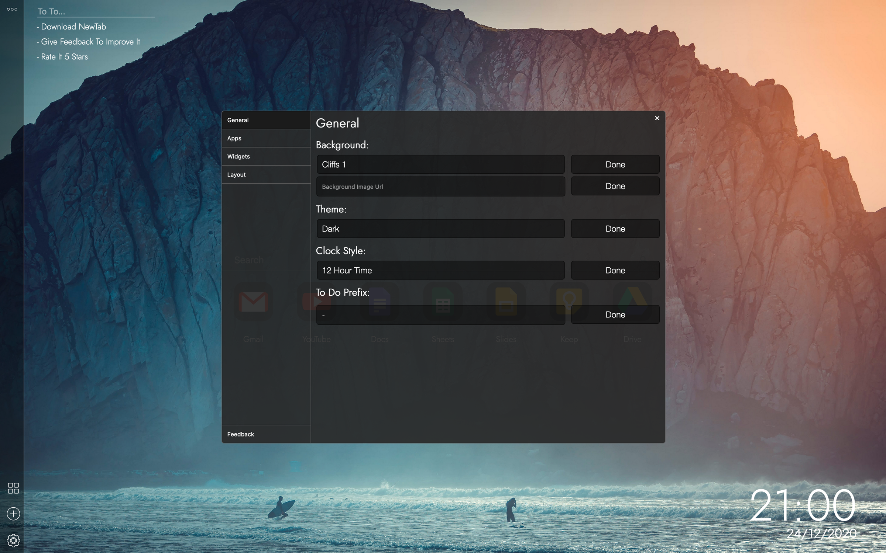

# Project Idea
The idea of NewTab was to create a free web extension to allow users to have a customizable new tab page that was hard to find with similar products. The entire project is based on customizability and simplicity.

# An Add-on For Everyone
NewTab is an all in one New Tab Add-on for every Firefox user. With heaps features such as autocomplete, notes, to do list, stats customization and more. This Add-on is going to continue to be improved and updated as user feedback is received.

# Widgets
NewTab Add-on has customizable widgets including stats, notes and an app creator and many more in development ready for the next update!

# Custom Offline Backgrounds:
NewTab allows you to use one of our pre-installed backgrounds or use the image URL of any image, supporting PNG, SVG, JPG, GIF, WEBP and more.

# Themes & Customization:
Try one of 3 NewTab themes and customize everything from app shape, custom app icons, style, widget theme, display style and more customization to come!

# Search Faster
Use Built in search prefixes such as "duckduckgo: YOUR_SEARCH", "image: YOUR_SEARCH", "mail: YOUR_SEARCH" or websites with automatic https://.

# Coming Soon:
- Weather
- Advanced Themes
- History
- Custom Toolbar Web Applications
- Chrome Support
- Developer Website
- !Bang Searching
- Export Settings
- Quote Of The Day

And Much Much More...