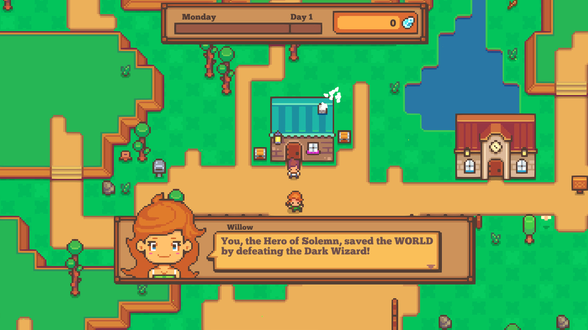
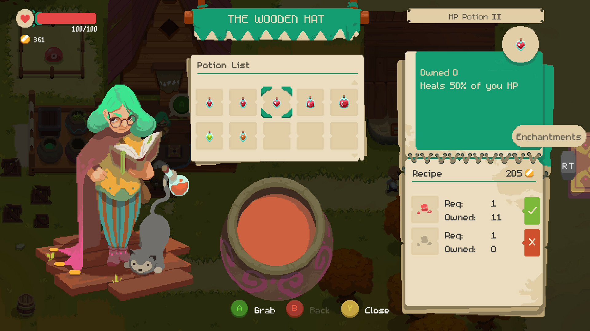

# Concept
The idea for the game is to make a top down style rpg game.
It is going to be built using javascript and canvas.
I am not yet sure about the art style or storyline however I want it to have combat mechanics like a dungeon crawler where you equipt a weapon and need to fight enemies to progress.
The game is loosely based on the Pizza Legends tutorial series by <a href='https://www.youtube.com/c/DrewConley/'>Drew Conley

# Brainstorming
- It will be story based rather than level based.
- The story will be the players focus, but it won't control the player. Instead they are free to do things at their own pace in the order they want.
- The game will have plenty of optional side stories & missions to give the player a deeper playthrough experience and better the replayability of the game.
- I want it to have a retro top down style while still feeling new.
- I would prefer it to have simple art style so that the art doesn't take up to much of the time I spend working on the game, as I am going to be doing it entirely myself.

# Inspiration
In order to develop an idea, I like to browse other similar projects and draw ideas from them, thinking about what features I could use in my game or could improve on, as well as what elements to avoid.

## Littlewood

I quite liked the very simple and flat game art from [Littlewood](https://store.steampowered.com/app/894940/Littlewood/), although the speech popup was way too obtrusive.
While the style might be a little too simple for the game I want to create, a tile based demo version could be useful to cut down the initial development time.

## Spindle
<!--  -->

I loved the art style and animations from [Spindle](https://store.steampowered.com/app/1386750/Spindle/), while it is probably well beyond my ability to have as much animation as this, I certainly could have some cool movement and action animations. I also like the attention to detail of the footprints in the snow. I also think that having a mechanic to be able to chop down some trees could provide opportunity to unlock secrets, perhaps even having some trees require a particular tool to be cut.

## Moonlighter
<!--  -->

While the art from [Moonlighter](https://store.steampowered.com/app/606150/Moonlighter/) is pretty good, I especially liked it's crafting and inventory system. 
I would like to implement some sort of crafting or upgrade system similar to this for tools and other items.

## Garden Story</h3>

I was interested in the flat, colorful art implemented in [Garden Story](https://store.steampowered.com/app/1062140/Garden_Story/). I quite liked the idea of a backpack however I thought the screen was a little bit busy. The fishing game mechanic seemed fun as well, I also noticed it in Spindle, so that could be something to add.

# The Idea
The game is going to be a top down game with grid based movement. 
It will be set around current year. 
Some of the game mechanics I want to include are an inventory system, health & hunger bars and interactive game objects & NPCs. I want the game to start in a forest so you can explore small campgrounds and cabins making the game feel more personal rather than having it set in a city or town.  This being said I want it to build up to you owning your own house that you can decorate & personalize to your taste.

# Creating a Story

### Main Story
The player's plane crashes in a dense forest, luckily there is a small campground nearby.
In the campground you one of the campers give you a map to the nearest town.
While your are exploring the forest you come across some small cabins and meet different people who will ask if you want to do something for a reward.
When you reach the town you explore different areas and other surrounding towns.
As you're exploring the town you find something that just doesn't add up.
You find that the mayor of the town has plans to have it demolished to build a mine.
Can you team up with the people you meet to find proof of the plans before it's too late.

### Side Stories, Missions & mechanics
1. There will be an ability to go fishing in lakes and ponds. The fish you collect can be eaten or traded with the fisherman for items.
2. There will be trees and rocks that you need a certain tool of a particular level to cut down in order to reach an new location.
3. This will give the ability to have some control over areas which the player has access while not restricting the player to a set path.